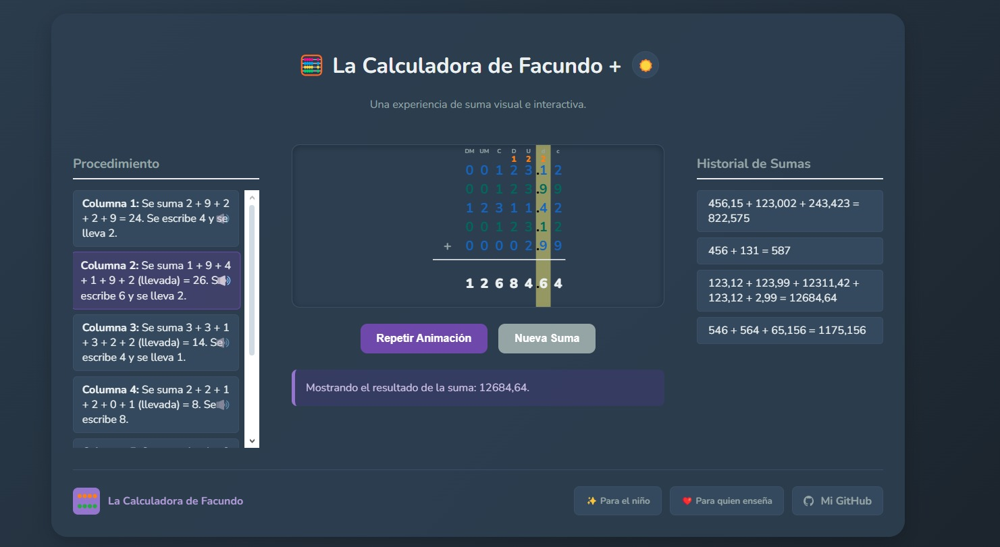
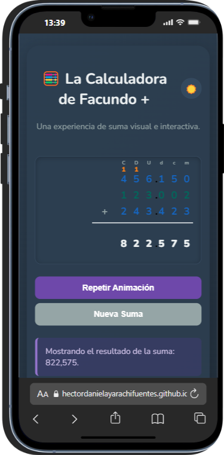
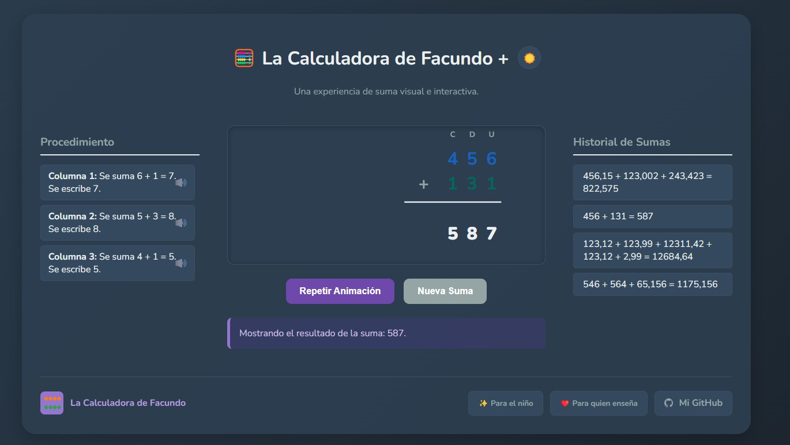
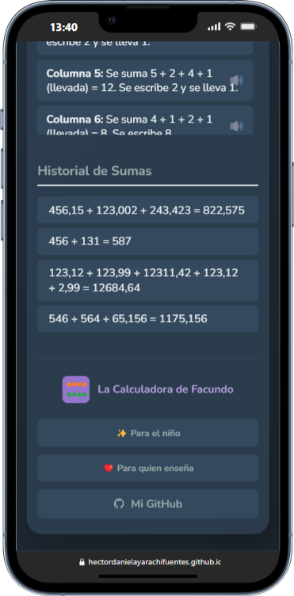

# 🧮 La Calculadora de Facundo +

¡Transformando la manera de aprender a sumar! La Calculadora de Facundo es una herramienta web interactiva y visual, diseñada especialmente para que los niños descubran que las matemáticas pueden ser divertidas y fáciles de entender.

A través de animaciones paso a paso y un innovador **apoyo auditivo**, esta calculadora descompone las sumas complejas en un proceso simple y lógico, reforzando el aprendizaje y la confianza.

### 🚀 **[Prueba la Calculadora en Vivo Aquí](https://hectordanielayarachifuentes.github.io/La-Calculadora-de-Facundo-SUMA/)** 🚀

---

## 📸 Vistazo General

<table>
  <tr>
    <td align="center"><strong>Suma de enteros y decimales en Escritorio</strong></td>
    <td align="center"><strong>Diseño Responsivo en Móvil</strong></td>
  </tr>
  <tr>
    <td></td>
    <td></td>
  </tr>
   <tr>
    <td align="center"><strong>Interfaz simple y clara</strong></td>
    <td align="center"><strong>Footer adaptable</strong></td>
  </tr>
    <tr>
    <td></td>
    <td></td>
  </tr>
</table>

---

## ✨ Características Principales

*   **Suma Visual Columna por Columna:** La calculadora anima todo el proceso de la suma, mostrando cómo se agrupan los números en cada columna (unidades, decenas, centenas) y cómo se "llevan" las cifras, tal como se aprende en la escuela.
*   **Apoyo Auditivo 🗣️:** ¡Una característica única! Cada paso del procedimiento tiene un ícono de altavoz. Al hacer clic, una voz clara lee la explicación en voz alta. Esto es ideal para reforzar el aprendizaje auditivo y para niños que están aprendiendo a leer.
*   **Procedimiento Detallado:** Al lado de la operación, se genera una lista con la explicación textual de cada paso. El niño puede repasarla en cualquier momento para entender por qué se llegó a ese resultado.
*   **Interfaz Amigable y Responsiva:** Con un diseño limpio, botones grandes y modo oscuro, la calculadora es fácil de usar en cualquier dispositivo, ya sea una computadora, una tablet o un teléfono móvil.
*   **Soporte para Decimales:** No se limita a números enteros. La calculadora maneja sumas con decimales de forma impecable, alineando las comas y explicando el proceso correctamente.
*   **Historial de Sumas:** Guarda las operaciones recientes para que puedas consultarlas fácilmente.

---

## ❤️ El Propósito: Aprender Rápido y Bien

Esta calculadora nace de la idea de que aprender matemáticas no tiene por qué ser aburrido o intimidante. Al visualizar el proceso y escuchar las explicaciones, los niños pueden conectar el concepto abstracto de la suma con una acción concreta y lógica.

El objetivo es simple:
1.  **Eliminar la frustración:** Descompone problemas grandes en pasos pequeños y manejables.
2.  **Fomentar la autonomía:** Permite que los niños experimenten y verifiquen sus tareas por sí mismos.
3.  **Hacerlo memorable:** La combinación de estímulos visuales y auditivos crea una experiencia de aprendizaje más profunda y duradera.

---

## 🛠️ Tecnologías Utilizadas

Este proyecto fue construido desde cero con las tecnologías fundamentales de la web:

*   **HTML5:** Para la estructura semántica del contenido.
*   **CSS3:** Para todo el diseño visual, incluyendo el modo oscuro, las animaciones y el diseño responsivo (Flexbox & Grid).
*   **JavaScript (Vanilla JS):** Para toda la lógica de la calculadora, la manipulación del DOM y las interacciones. Se utilizó la **Web Speech API** para implementar la funcionalidad de texto a voz.

---

## 👤 Autor

Desarrollado con ❤️ por **Héctor Daniel Ayarachi Fuentes**.

*   **[GitHub: @HectorDanielAyarachiFuentes](https://github.com/HectorDanielAyarachiFuentes)**